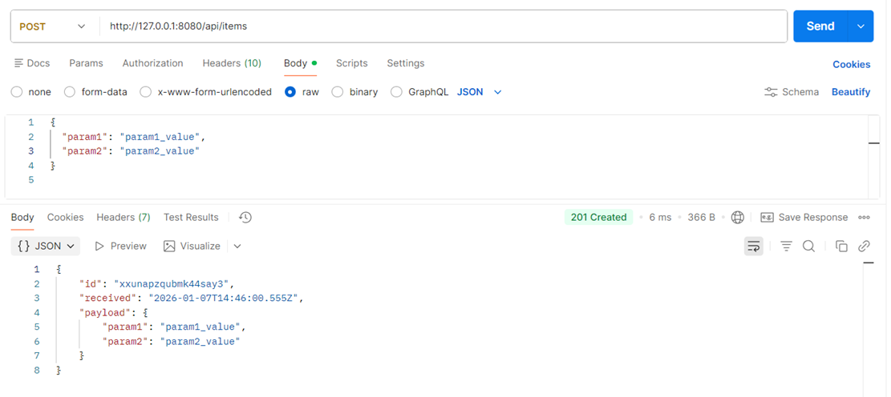

## Swagger file

Swagger file - [openapi.yml](https://github.com/Iurii132/sample-doc-site/blob/main/application/openapi.yml).

## Base URL

Base URL: http://localhost:8080


## Endpoints

The following table provides a summary of endpoints:

|**Endpoint**|**Method**|**Description**|
|--|--|--|
|`/api/items`|GET|Returns an array of items stored in memory.|
|`/api/items`|POST|Creates a new item in memory based on the provided JSON body.|
|`/api/items/<id>`|GET|Returns a single item by `id` (404 if not found).|
|`/api/items/<id>`|PATCH|Applies a partial update to a stored item's payload (200 on success, 400/404 on error).|
|`/api/items/<id>`|DELETE|Deletes an item by `id` (204 on success, 404 if not found).|


### GET

- GET `/api/items`

    - Description: Returns an array of items stored in memory.
    - Response code: 200 OK

**Example - curl:**

Request: `curl http://localhost:8080/api/items`

Response: `[{"id":"ye5q3z8hzimk553jxu","received":"2026-01-08T07:42:31.602Z","payload":{"name":"test"}}]`
	


**Example - Postman:**

Request:

- Method: GET

- URL: http://localhost:8080/api/items

Response code: 200 OK (Request successful. The server responded as required.)

Response body:

```JSON
[
    {
        "id": "eaupwdpol3dmk55h47i",
        "received": "2026-01-08T07:53:04.398Z",
        "payload": {
            "param1": "param1_value",
            "param2": "param2_value",
            "name": "value"
        }
    },
    {
        "id": "26s58izyhxtmk55zj26",
        "received": "2026-01-08T08:07:23.454Z",
        "payload": {
            "param1": "param1_value",
            "param2": "param2_value",
            "name": "value"
        }
    }
]
```


### POST

- POST `/api/items`

    - Description: Accepts an arbitrary JSON body and creates a new item.
    - Request body: any non-empty JSON object. Example: `{ "name": "sample" }`
    - Success: 201 Created with the created item in the response body.
    - Error: 400 Bad Request when payload is empty or invalid JSON.

!!!Note
    - `id` is generated via `cryptoRandomId()` in `application/server.js` and is not meant to be collision-resistant.

**Example - curl:**

Request: `curl -X POST "http://localhost:8080/api/items" -H "Content-Type: application/json" -d "{\"name\":\"test\"}"`

Response: `{"id":"ye5q3z8hzimk553jxu","received":"2026-01-08T07:42:31.602Z","payload":{"name":"test"}}`

**Example - Postman:**
    
Request:

- Method: POST
- URL: http://localhost:8080/api/items
- Headers: 

    -  Key: Content-Type
    -  Value: application/json
	
- Body: raw → JSON
   
    ```JSON
    {
      "name": "Sample Item",
      "description": "This is a test item for API validation",
      "quantity": 42,
      "price": 19.99,
      "tags": ["test", "api", "json"],
      "metadata": {
        "createdBy": "Iurii",
        "timestamp": "2026-01-07T10:30:00Z",
        "status": "active"
      },
      "attributes": [
        {
          "key": "color",
          "value": "blue"
        },
        {
          "key": "size",
          "value": "medium"
        }
      ]
    }
    ```

Response code: 201 Created (A new resource was created successfully)

Response body:

```JSON
{
    "id": "7c1tgp4dq7smk57xw9d",
    "received": "2026-01-08T09:02:06.481Z",
    "payload": {
        "name": "Sample Item",
        "description": "This is a test item for API validation",
        "quantity": 42,
        "price": 19.99,
        "tags": [
            "test",
            "api",
            "json"
        ],
        "metadata": {
            "createdBy": "Iurii",
            "timestamp": "2026-01-07T10:30:00Z",
            "status": "active"
        },
        "attributes": [
            {
                "key": "color",
                "value": "blue"
            },
            {
                "key": "size",
                "value": "medium"
            }
        ]
    }
}
```



### PATCH

PATCH `/api/items/<id>`

- Description: Applies a partial update to the stored item's payload. The request body must be a non-empty JSON object. Fields provided will be shallow-merged into the existing payload.

- Success: 200 OK with the updated item in the response body.
- Errors: 400 Bad Request when payload is empty or invalid JSON; 404 Not Found when the id does not exist.

**Example - curl:**

Request: `curl -X PATCH "http://localhost:8080/api/items/<id>" -H "Content-Type: application/json" -d "{\"price\":29.99}"`

Response: `{"id":"ye5q3z8hzimk553jxu","received":"2026-01-08T07:42:31.602Z","modified":"2026-01-09T12:00:00.000Z","payload":{"name":"test","price":29.99}}`


### GET by id

GET `/api/items/<id>`

- Description: Returns a single item by `id`.

- Response code: 200 OK with the item body, or 404 Not Found if the id does not exist.

**Example - curl:**

Request: `curl -s http://localhost:8080/api/items/ye5q3z8hzimk553jxu`

Response: `{"id":"ye5q3z8hzimk553jxu","received":"2026-01-08T07:42:31.602Z","payload":{"name":"test"}}`

### DELETE by id

DELETE `/api/items/<id>`

- Description: Deletes the item with the given `id`.
- Success: 204 No Content on successful deletion.
- Error: 404 Not Found if the id does not exist.

**Example - curl:**

Request: `curl -X DELETE http://localhost:8080/api/items/26s58izyhxtmk55zj26`

Response: Empty.
