## Overview

[server.js](https://github.com/Iurii132/learning-tech/blob/main/application/server.js) is a tiny example Node.js Express server application intended as a demo component for the docs site. It accepts items with arbitrary JSON payloads and stores items in an in-memory array.

```mermaid

flowchart TB
    subgraph A[Node.js Express]
    style A fill:#dbeafe,stroke:#333,stroke-width:1px

        subgraph B[server.js]
        style B fill:#fde2e2,stroke:#333,stroke-width:1px

            subgraph C[API - http://localhost:8080/api/items]
            style C fill:#d1fae5,stroke:#333,stroke-width:1px

                GET[🔎 GET]
                GET_ID[🔍 GET by id]
                POST[➕ POST]
                DELETE_ID[🗑️ DELETE by id]

            end
        end
    end


    class GET,GET_ID get;
    classDef get fill:#3b82f6;
    classDef get stroke:#1e3a8a;
    classDef get color:#fff;
    classDef get stroke-width:1px;
	
    class POST post;
    classDef post fill:#10b981;
    classDef post stroke:#064e3b;
    classDef post color:#fff;
    classDef post stroke-width:1px;	
	
    class DELETE_ID delete;
	classDef delete fill:#ef4444;
    classDef delete stroke:#7f1d1d;
    classDef delete color:#fff;
    classDef delete stroke-width:1px;	
		

```

## Purpose

- Test work with API through a client, such as curl or Postman.
- Explore AI capabilities to extend the application and write documentation.

## Typical workflows

- Start the server via `node application/server.js` and use `curl` or Postman to exercise endpoints.
- Open the `application/server.js` file to understand request validation and ID generation logic (`cryptoRandomId()`).
- Modify the `application/server.js` file to add endpoints or other features.

## Prerequisites

- Download and install [node.js](https://nodejs.org/en/download)

## Quick start

### Run the application

1. Clone the [repository](https://github.com/Iurii132/learning-tech.git) or download the [application](https://github.com/Iurii132/learning-tech/tree/main/application) folder.

1. Open a command prompt.

1. Go to the `application` folder.

    `cd application`
	
1. Initialize a Node project:

	`npm init -y`

1. Install the `express` module.

	`npm install express`		
	
1. Run the application:

    `node server.js`

	
### Execute a request

Execute an API request using curl or Postman. For more information, see the [API guide](api-guide.md).

