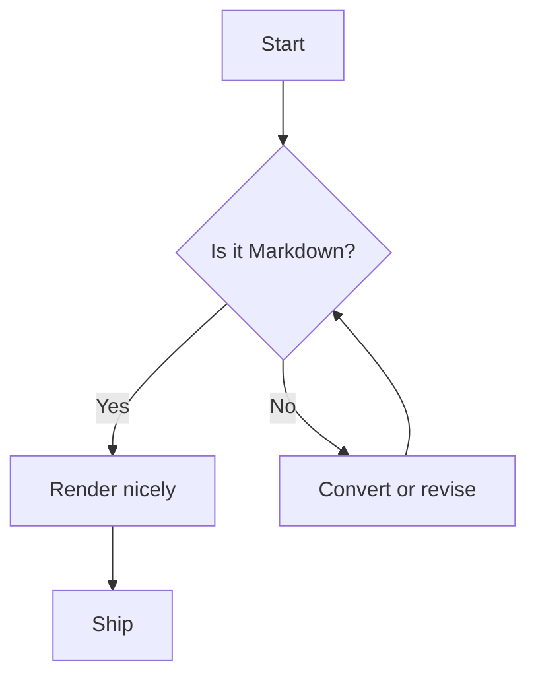
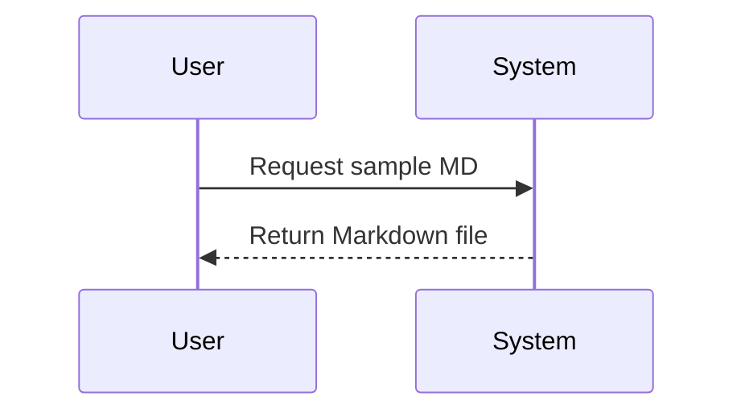

## Overview

This page includes common markdown syntax.

## Paragraph text

Intro paragraph showing **bold**, *italic*, and `inline code`. Also a [link](https://github.com/Iurii132/sample-doc-site) and an image:


---

# Heading 1

Use the `#` symbol to define a heading.


## Heading 2 

 `##`

### Heading 3 

`###`

#### Heading 4 

 `####`

##### Heading 5 

 `#####`

###### Heading 6 

 `######`

---

## Lists 

 `-`, `*`, `+` (bulleted) and `1.` (ordered)

List:

- Bullet item using `-`

    Indented text `four spaces`

    - Nested bullet `-` plus four spaces ` `
	
        Indented text `eight spaces`
	
        - Third level  `-` plus eight spaces ` `
		
            Indented text `twelve spaces`
	
List:

* Bullet item using `*`

List:

+ Bullet item using `+`


List:

1. First ordered item using `1.`

1. Second ordered item

    1. Nested ordered item `1.` plus four spaces ` `
    1. Another nested item


List:

- [ ] Task list item (unchecked) — `- [ ]`
- [x] Task list item (checked) — `- [x]`

---

## Blockquotes 

 `>`

> This is a blockquote introduced by `>`. It can span multiple lines.
> 
> Second line in the same quote.

---

## Admonitions / Callouts 

!!!NOTE
    This is a **Note** callout using `!!!NOTE`. The text is in a separate paragraph prefixed with four spaces.
	 


!!!TIP
 
    This is a **Tip** callout using `!!! TIP`. The text is in a separate paragraph prefixed with four spaces.
 

!!!WARNING
    This is a **Warning** callout using `!!!WARNING`. The text is in a separate paragraph prefixed with four spaces.

!!!IMPORTANT
    This is an **Important** callout using `!!!IMPORTANT`. The text is in a separate paragraph prefixed with four spaces.

!!!CAUTION
    This is a **Caution** callout using `!!!CAUTION`. The text is in a separate paragraph prefixed with four spaces.

---

## Code — line 

Opening and closing "`".

`code`

## Code — fenced blocks 

Opening and closing three /`  and launguage hints.

```bash
# Bash sample
mkdir -p sample && cd sample
ls -la
```

```python
# Python sample
from math import sqrt
nums = [1, 4, 9, 16]
roots = [sqrt(n) for n in nums]
print(roots)
```

```json
{
  "name": "Sample",
  "version": "1.0.0"
}
```

---

## Tables 

Pipes `|` and dashes `-`

| Column A — header | Column B — header | Column C — header |
|-------------------|-------------------|-------------------|
| Cell A1           | Cell B1           | Cell C1           |
| Cell A2           | Cell B2           | Cell C2           |
| **Bold**          | *Italic*          | `Inline code`     |

> Tip: align columns using colons in the separator row:

| Left align | Center align | Right align |
|:-----------|:------------:|------------:|
| left       |   center     |       right |

---

## Horizontal rule 

 `---` or `***` or `___`

Above and below this section are horizontal rules.

---


## Footnotes 

 `[^1]`

Here is a sentence with a footnote reference.[^1]

[^1]: This is the footnote content written later in the document.

---

## Task-specific metadata (YAML front matter) 

 `---` at top (optional)

You can add YAML front matter at the top of a file for site generators:

```yaml
---
title: "Markdown Style Sampler"
description: "Demonstrates common Markdown features and tags"
author: "Your Name"
---
```

---


## HTML passthrough (when allowed)

<div style=\"border:1px solid #ccc;padding:8px\">
  <strong>Inline HTML</strong> can be used when your renderer supports it.
</div>

---

## Escaping Characters 

 `\` (backslash)

Use a backslash to escape special characters: \* \_ \# \[ \] \( \) \`.

---

## Anchors and IDs (renderer-dependent)

Most platforms auto-generate heading anchors. You can also create manual anchors:

### Custom Anchor

{#custom-anchor}

Link to the custom anchor: [Jump to custom anchor](#custom-anchor)

---

## Mermaid diagrams

Material for MkDocs integrates with Mermaid.js, a very popular and flexible solution for drawing diagrams using code.



Another Mermaid example (sequence diagram):



## Checklist of tags used

- Heading 1 — `#`
- Heading 2 — `##`
- Heading 3 — `###`
- Heading 4 — `####`
- Heading 5 — `#####`
- Heading 6 — `######`
- Bulleted lists — `-`, `*`, `+`
- Ordered lists — `1.`
- Task lists — `- [ ]`, `- [x]`
- Blockquotes — `>`
- Callouts — `!!!Note` and so on
- Code blocks — triple backticks ` with language hints
- Inline code — backticks `
- Bold — `**text**`
- Italic — `*text*`
- Links — `[text](url)`
- Images — ``
- Tables — `|` with header separator row made of `-`
- Horizontal rules — `---`, `***`, `___`
- Footnotes — `[^id]`
- HTML passthrough — `<div>...</div>`
- Escapes — `\`
- Custom anchor attribute — `{#id}`

